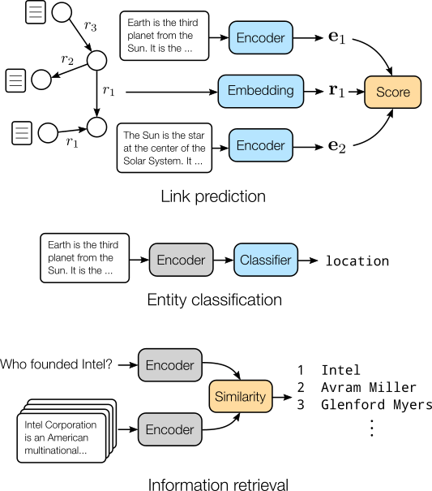

# Inductive entity representations from text via link prediction

<div>
<a href="https://github.com/migalkin/StarE/blob/master/LICENSE">
    </a>
    <a href="https://doi.org/10.5281/zenodo.4501273"></a>
</div>

<br><br>
<div align="center">

</div>
<br><br>

This repository contains the code used for the experiments in the paper "Inductive entity representations from text via link prediction", presented at The Web Conference, 2021. To refer to our work, please use the following:

```bibtex
@inproceedings{daza2021inductive,
    title = {Inductive Entity Representations from Text via Link Prediction},
    author = {Daniel Daza and Michael Cochez and Paul Groth},
    booktitle = {Proceedings of The Web Conference 2021},
    year = {2021},
    doi = {10.1145/3442381.3450141},
}
```

In this work, we show how a BERT-based text encoder can be fine-tuned with a link prediction objective, in a graph where entities have an associated textual description. We call the resulting model BLP. There are three interesting properties of a trained BLP model:

- It can predict a link between entities, even if one or both were not present during training.
- It produces useful representations for a classifier, that don't require retraining the encoder.
- It improves an information retrieval system, by better matching entities and questions about them.

## Usage

Please follow the instructions next to reproduce our experiments, and to train a model with your own data.

### 1. Install the requirements

Creating a new environment (e.g. with `conda`) is recommended. Use `requirements.txt` to install the dependencies:

```sh
conda create -n blp python=3.7
conda activate blp
pip install -r requirements.txt
```

### 2. Download the data

Download the required compressed datasets into the `data` folder:

| Download link                                                | Size (compressed) |
| ------------------------------------------------------------ | ----------------- |
| [UMLS](https://surfdrive.surf.nl/files/index.php/s/NvuKQuBetmOUe1b/download) (small graph for tests) | 121 KB            |
| [WN18RR](https://surfdrive.surf.nl/files/index.php/s/N1c8VRH0I6jTJuN/download) | 6.6 MB            |
| [FB15k-237](https://surfdrive.surf.nl/files/index.php/s/rGqLTDXRFLPJYg7/download) | 21 MB             |
| [Wikidata5M](https://surfdrive.surf.nl/files/index.php/s/TEE96zweMxsoGmR/download) | 1.4 GB            |
| [GloVe embeddings](https://surfdrive.surf.nl/files/index.php/s/zAHCIBc6PAb3NXi/download) | 423 MB            |
| [DBpedia-Entity](https://surfdrive.surf.nl/files/index.php/s/BOD7SoDTchVO9ed/download) | 1.3 GB            |

Then use `tar` to extract the files, e.g.

```sh
tar -xzvf WN18RR.tar.gz
```

Note that the KG-related files above contain both *transductive* and *inductive* splits. Transductive splits are commonly used to evaluate lookup-table methods like ComplEx, while inductive splits contain entities in the test set that are not present in the training set. Files with triples for the inductive case have the `ind` prefix, e.g. `ind-train.txt`.

### 2. Reproduce the experiments

**Link prediction**

To check that all dependencies are correctly installed, run a quick test on a small graph (this should take less than 1 minute on GPU):

```sh
./scripts/test-umls.sh
```

The following table is a adapted from our paper. The "Script" column contains the name of the script that reproduces the experiment for the corresponding model and dataset. For example, if you want to reproduce the results of BLP-TransE on FB15k-237, run

```sh
./scripts/blp-transe-fb15k237.sh
```

<table>
<thead>
  <tr>
    <th></th>
    <th colspan="2">WN18RR</th>
    <th colspan="2">FB15k-237</th>
    <th colspan="2">Wikidata5M</th>
  </tr>
</thead>
<tbody>
  <tr>
    <td>Model</td>
    <td>MRR</td>
    <td>Script</td>
    <td>MRR</td>
    <td>Script</td>
    <td>MRR</td>
    <td>Script</td>
  </tr>
  <tr>
    <td>GlovE-BOW</td>
    <td>0.170</td>
    <td>glove-bow-wn18rr.sh</td>
    <td>0.172</td>
    <td>glove-bow-fb15k237.sh</td>
    <td>0.343</td>
    <td>glove-bow-wikidata5m.sh</td>
  </tr>
  <tr>
    <td>BE-BOW</td>
    <td>0.180</td>
    <td>bert-bow-wn18rr.sh</td>
    <td>0.173</td>
    <td>bert-bow-fb15k237.sh</td>
    <td>0.362</td>
    <td>bert-bow-wikidata5m.sh</td>
  </tr>
  <tr>
    <td>GloVe-DKRL</td>
    <td>0.115</td>
    <td>glove-dkrl-wn18rr.sh</td>
    <td>0.112</td>
    <td>glove-dkrl-fb15k237.sh</td>
    <td>0.282</td>
    <td>glove-dkrl-wikidata5m.sh</td>
  </tr>
  <tr>
    <td>BE-DKRL</td>
    <td>0.139</td>
    <td>bert-dkrl-wn18rr.sh</td>
    <td>0.144</td>
    <td>bert-dkrl-fb15k237.sh</td>
    <td>0.322</td>
    <td>bert-dkrl-wikidata5m.sh</td>
  </tr>
  <tr>
    <td>BLP-TransE</td>
    <td>0.285</td>
    <td>blp-transe-wn18rr.sh</td>
    <td>0.195</td>
    <td>blp-transe-fb15k237.sh</td>
    <td>0.478</td>
    <td>blp-transe-wikidata5m.sh</td>
  </tr>
  <tr>
    <td>BLP-DistMult</td>
    <td>0.248</td>
    <td>blp-distmult-wn18rr.sh</td>
    <td>0.146</td>
    <td>blp-distmult-fb15k237.sh</td>
    <td>0.472</td>
    <td>blp-distmult-wikidata5m.sh</td>
  </tr>
  <tr>
    <td>BLP-ComplEx</td>
    <td>0.261</td>
    <td>blp-complex-wn18rr.sh</td>
    <td>0.148</td>
    <td>blp-complex-fb15k237.sh</td>
    <td>0.489</td>
    <td>blp-complex-wikidata5m.sh</td>
  </tr>
  <tr>
    <td>BLP-SimplE</td>
    <td>0.239</td>
    <td>blp-simple-wn18rr.sh</td>
    <td>0.144</td>
    <td>blp-simple-fb15k237.sh</td>
    <td>0.493</td>
    <td>blp-simple-wikidata5m.sh</td>
  </tr>
</tbody>
</table>


**Entity classification**

After training for link prediction, a tensor of embeddings for all entities is computed and saved in a file with name `ent_emb-[ID].pt` where `[ID]` is the id of the experiment in the database (we use [Sacred](https://sacred.readthedocs.io/en/stable/index.html) to manage experiments). Another file called `ents-[ID].pt` contains entity identifiers for every row in the tensor of embeddings.

To ease reproducibility, we provide these tensors, which are required in the entity classification task. Click on the ID, download the file into the `output` folder, and decompress it. An experiment can be reproduced using the following command:

```sh
python train.py node_classification with checkpoint=ID dataset=DATASET
```

where `DATASET` is either `WN18RR` or `FB15k-237`. For example:

```sh
python train.py node_classification with checkpoint=199 dataset=WN18RR
```


<table>
<thead>
  <tr>
    <th></th>
    <th colspan="2">WN18RR</th>
    <th colspan="2">FB15k-237</th>
  </tr>
</thead>
<tbody>
  <tr>
    <td>Model</td>
    <td>Acc.</td>
    <td>ID</td>
    <td>Acc. Bal.</td>
    <td>ID</td>
  </tr>
  <tr>
    <td>GloVe-BOW</td>
    <td>55.3</td>
    <td><a href="https://surfdrive.surf.nl/files/index.php/s/dAac2HSzTVOZXXF/download" target="_blank" rel="noopener noreferrer">219</a></td>
    <td>34.4</td>
    <td><a href="https://surfdrive.surf.nl/files/index.php/s/CmM3S3zFBeB2rIx/download" target="_blank" rel="noopener noreferrer">293</a></td>
  </tr>
  <tr>
    <td>BE-BOW</td>
    <td>60.7</td>
    <td><a href="https://surfdrive.surf.nl/files/index.php/s/3YQzViDa2xfskSt/download" target="_blank" rel="noopener noreferrer">218</a></td>
    <td>28.3</td>
    <td><a href="https://surfdrive.surf.nl/files/index.php/s/TGWmNq7MXlFPiQ0/download" target="_blank" rel="noopener noreferrer">296</a></td>
  </tr>
  <tr>
    <td>GloVe-DKRL</td>
    <td>55.5</td>
    <td><a href="https://surfdrive.surf.nl/files/index.php/s/tTs6x39SY4DxXV2/download" target="_blank" rel="noopener noreferrer">206</a></td>
    <td>26.6</td>
    <td><a href="https://surfdrive.surf.nl/files/index.php/s/bRrQiLl2ZVxfhDO/download" target="_blank" rel="noopener noreferrer">295</a></td>
  </tr>
  <tr>
    <td>BE-DKRL</td>
    <td>48.8</td>
    <td><a href="https://surfdrive.surf.nl/files/index.php/s/wwfU6lxnywxAeO2/download" target="_blank" rel="noopener noreferrer">207</a></td>
    <td>30.9</td>
    <td><a href="https://surfdrive.surf.nl/files/index.php/s/nRqY6dWS0ermX4X/download" target="_blank" rel="noopener noreferrer">294</a></td>
  </tr>
  <tr>
    <td>BLP-TransE</td>
    <td>81.5</td>
    <td><a href="https://surfdrive.surf.nl/files/index.php/s/SGYvIT2iuPqhett/download" target="_blank" rel="noopener noreferrer">199</a></td>
    <td>42.5</td>
    <td><a href="https://surfdrive.surf.nl/files/index.php/s/VpmltGpMHzUdbsw/download" target="_blank" rel="noopener noreferrer">297</a></td>
  </tr>
  <tr>
    <td>BLP-DistMult</td>
    <td>78.5</td>
    <td><a href="https://surfdrive.surf.nl/files/index.php/s/evFOoBufK6BQ69V/download" target="_blank" rel="noopener noreferrer">200</a></td>
    <td>41.0</td>
    <td><a href="https://surfdrive.surf.nl/files/index.php/s/lXrvINpxHTkmdup/download" target="_blank" rel="noopener noreferrer">298</a></td>
  </tr>
  <tr>
    <td>BLP-ComplEx</td>
    <td>78.1</td>
    <td><a href="https://surfdrive.surf.nl/files/index.php/s/MNMrI6dddeybgum/download" target="_blank" rel="noopener noreferrer">201</a></td>
    <td>38.1</td>
    <td><a href="https://surfdrive.surf.nl/files/index.php/s/MkDGfJXy1ANTBeQ/download" target="_blank" rel="noopener noreferrer">300</a></td>
  </tr>
  <tr>
    <td>BLP-SimplE</td>
    <td>83.0</td>
    <td><a href="https://surfdrive.surf.nl/files/index.php/s/n5sJIY4QZhzo3bU/download" target="_blank" rel="noopener noreferrer">202</a></td>
    <td>45.7</td>
    <td><a href="https://surfdrive.surf.nl/files/index.php/s/B7nuyaJw9F61dwP/download" target="_blank" rel="noopener noreferrer">299</a></td>
  </tr>
</tbody>
</table>


**Information retrieval**

This task runs with a pre-trained model saved from the link prediction task. For example, if the model trained is `blp` with `transe` and it was saved as `model.pt`, then run the following command to run the information retrieval task:

```sh
python retrieval.py with model=blp rel_model=transe \
checkpoint='output/model.pt'
```


## Using your own data

If you have a knowledge graph where entities have textual descriptions, you can train a BLP model for the tasks of inductive link prediction, and entity classification (if you also have labels for entities).

To do this, add a new folder inside the `data` folder (let's call it `my-kg`). Store in it a file containing the triples in your KG. This should be a text file with one tab-separated triple per line (let's call it `all-triples.tsv`).

To generate inductive splits, you can use `data/utils.py`. If you run

```sh
python utils.py drop_entities --file=my-kg/all-triples.tsv
```

this will generate `ind-train.tsv`, `ind-dev.tsv`, `ind-test.tsv` inside `my-kg` (see Appendix A in our paper for details on how these are generated). You can then train BLP-TransE with

```sh
python train.py with dataset='my-kg'
```

## Alternative implementations

- [Contextual Knowledge Bases](https://github.com/raphaelsty/ckb) by Raphael Sourty
